# Study Hub UI Enhancement Design

## Overview

This design document outlines creative UI enhancements for the Study Hub web application, transforming it from a functional study platform into a more visually engaging and organized educational experience. The enhancements will maintain all existing functionality while introducing modern design patterns, improved visual hierarchy, and enhanced user engagement.

## Technology Stack & Dependencies

**Current Stack:**
- Vanilla HTML5, CSS3, JavaScript
- Netlify deployment
- JSON-based data structure

**Enhanced Features:**
- CSS Grid & Flexbox layouts
- CSS Custom Properties (variables)
- CSS animations and transitions
- Responsive design patterns
- Modern typography system
- Icon integration (SVG sprites)

## Component Architecture

### Enhanced Header Component


**Header Enhancements:**
- Animated logo with hover effects
- Glassmorphism design with backdrop blur
- Floating search bar with autocomplete styling
- Quick navigation breadcrumbs
- Department quick-access chips

### Course Card Component Redesign

**Visual Hierarchy:**
- Department-based color coding system
- Gradient overlays for visual depth
- Animated hover states with elevation
- Progress indicators for resource completion
- Interactive tag system with hover tooltips

**Card Structure:**
```
┌─────────────────────────────────┐
│ [Dept Icon] AP Physics 1        │ ← Header with icon
│ Science • Grades 11-12          │ ← Metadata row
│ ━━━━━━━━━━━━━━━━━━━━━━━━━━━━━━━ │ ← Color-coded divider
│                                 │
│ Kinematics, dynamics, energy... │ ← Description preview
│                                 │
│ 🎥 Videos  📄 PDFs  ✏️ Exercises │ ← Resource type indicators
│                                 │
│ [View Course] [Syllabus →]      │ ← Action buttons
└─────────────────────────────────┘
```

### Course Detail Page Layout

**Information Architecture:**
- Hero section with course overview
- Tabbed resource organization
- Resource cards with preview capabilities
- Related courses suggestions
- Progress tracking visual indicators


## Design System

### Color Palette

**Primary Colors:**
- **Science/STEM**: `#6366f1` (Indigo) to `#8b5cf6` (Purple) gradient
- **Mathematics**: `#059669` (Emerald) to `#0d9488` (Teal) gradient  
- **Social Studies**: `#dc2626` (Red) to `#ea580c` (Orange) gradient
- **Language Arts**: `#7c3aed` (Violet) to `#c026d3` (Fuchsia) gradient

**Neutral Palette:**
- **Background**: `#fafafa` (light) / `#0f0f23` (dark)
- **Surface**: `#ffffff` (light) / `#1e1e3f` (dark)
- **Text Primary**: `#0f172a` (light) / `#f1f5f9` (dark)
- **Text Secondary**: `#64748b` (light) / `#94a3b8` (dark)

### Typography Scale

**Font Hierarchy:**
- **Display**: 3rem (48px) - Course page headlines
- **Heading 1**: 2.25rem (36px) - Section titles
- **Heading 2**: 1.875rem (30px) - Card titles
- **Heading 3**: 1.5rem (24px) - Resource titles
- **Body**: 1rem (16px) - Main content
- **Caption**: 0.875rem (14px) - Metadata

**Font Stack:**
```css
font-family: 'Inter', -apple-system, BlinkMacSystemFont, 'Segoe UI', 
             system-ui, sans-serif;
```

### Spacing System

**Scale (based on 0.25rem units):**
- **xs**: 0.25rem (4px)
- **sm**: 0.5rem (8px)  
- **md**: 1rem (16px)
- **lg**: 1.5rem (24px)
- **xl**: 2rem (32px)
- **2xl**: 3rem (48px)
- **3xl**: 4rem (64px)

## Enhanced UI Components

### Smart Search Interface

**Features:**
- Floating search bar with glassmorphism effect
- Real-time search suggestions dropdown
- Search history with quick access
- Advanced filters in expandable panel
- Keyboard navigation support

**Search Enhancement Structure:**
```
┌─────────────────────────────────────────┐
│ 🔍 Search courses, topics, resources... │ ← Main search input
│ ─────────────────────────────────────── │
│ Recent: "AP Physics" "Calculus"         │ ← Recent searches
│ ─────────────────────────────────────── │
│ 📚 Suggestions:                         │
│ • AP Physics 1 - Science               │ ← Intelligent suggestions
│ • Physics Resources - Department       │
│ • Mechanics - Topic                    │ ← Type-based categorization
└─────────────────────────────────────────┘
```

### Interactive Filter System

**Filter Categories:**
- Department pills with color coding
- Grade level range slider
- Resource type toggles with icons
- Tag cloud with popularity indicators

**Filter Component Design:**
```
Departments: [Science] [Math] [Social Studies] [English]
Grades:      [-----●----] 9-12
Resources:   [🎥] [📄] [✏️] [🔗]
Tags:        #physics #calculus #history #writing
```

### Resource Preview Cards

**Enhanced Resource Display:**
- Thumbnail previews for video content
- File type icons with size indicators  
- Provider badges with trust indicators
- Difficulty level visual indicators
- Estimated time completion badges

**Resource Card Layout:**
```
┌─────────────────────────────────────┐
│ [🎥 Thumbnail] │ Kinematics Crash    │ ← Visual preview
│                │ Course              │
│                │ YouTube • 15 min    │ ← Provider & duration
│                │ ⭐⭐⭐⭐⭐ Beginner  │ ← Rating & difficulty
│                │ [▶️ Watch] [📌 Save] │ ← Quick actions
└─────────────────────────────────────┘
```

### Department Navigation Hub

**Quick Access Design:**
- Circular department icons with animations
- Color-coded backgrounds matching the design system
- Hover effects revealing course counts
- Smooth transitions between states

```mermaid
graph LR
    A[🔬 Science<br/>5 courses] --> B[📐 Math<br/>3 courses]
    B --> C[🏛️ Social Studies<br/>4 courses]
    C --> D[📚 English<br/>6 courses]
    D --> E[🎨 Arts<br/>2 courses]
```



## Styling Strategy

### CSS Architecture

**Modular CSS Structure:**
```
styles/
├── base/
│   ├── reset.css          # CSS reset and normalize
│   ├── variables.css      # CSS custom properties
│   └── typography.css     # Font definitions
├── components/
│   ├── header.css         # Header component styles
│   ├── cards.css          # Course and resource cards
│   ├── filters.css        # Search and filter components
│   └── buttons.css        # Button variations
├── layouts/
│   ├── grid.css          # Grid system
│   └── containers.css    # Container layouts
└── utilities/
    ├── animations.css    # Keyframe animations
    └── responsive.css    # Media queries
```

### Animation System

**Micro-interactions:**
- Card hover elevations with smooth transitions
- Button press feedback animations
- Loading state spinners and skeletons
- Page transition effects
- Scroll-triggered animations

**Key Animation Examples:**
```css
/* Card hover animation */
.card {
  transition: transform 0.3s cubic-bezier(0.4, 0, 0.2, 1),
              box-shadow 0.3s cubic-bezier(0.4, 0, 0.2, 1);
}

.card:hover {
  transform: translateY(-8px) scale(1.02);
  box-shadow: 0 20px 40px rgba(0, 0, 0, 0.1);
}

/* Search bar focus animation */
.search-input:focus {
  transform: scale(1.05);
  box-shadow: 0 0 0 3px rgba(99, 102, 241, 0.1);
}
```

### Responsive Design Strategy

**Breakpoint System:**
- **Mobile**: 320px - 767px
- **Tablet**: 768px - 1023px  
- **Desktop**: 1024px - 1440px
- **Large Desktop**: 1441px+

**Layout Adaptations:**
- Mobile: Single column with bottom navigation
- Tablet: Two-column grid with sidebar filters
- Desktop: Three-column grid with persistent sidebar
- Large: Four-column grid with enhanced spacing

## State Management

### UI State Handling

**Application States:**
- Loading states with skeleton screens
- Empty states with meaningful illustrations
- Error states with helpful recovery actions
- Success states with positive feedback

**Interactive States:**
- Hover effects for all interactive elements
- Active states for selected filters
- Focus states for keyboard navigation
- Disabled states for unavailable actions

### Visual Feedback System

**User Feedback Mechanisms:**
- Toast notifications for actions
- Progress indicators for loading
- Confirmation dialogs for destructive actions
- Subtle animations for state changes

## Implementation Roadmap

### Phase 1: Foundation Enhancement
1. **CSS Variables System**: Implement design tokens
2. **Typography Improvements**: Update font hierarchy
3. **Color System**: Apply department-based color coding
4. **Basic Animations**: Add hover and transition effects

### Phase 2: Component Redesign
1. **Header Enhancement**: Implement glassmorphism design
2. **Card Redesign**: Add department icons and improved layout
3. **Search Enhancement**: Create floating search interface
4. **Filter System**: Build interactive filter components

### Phase 3: Advanced Features
1. **Resource Previews**: Add thumbnail and metadata display
2. **Department Hub**: Create quick navigation system
3. **Advanced Animations**: Implement scroll-triggered effects
4. **Responsive Optimization**: Ensure perfect mobile experience

### Phase 4: Polish & Optimization
1. **Performance Optimization**: Minimize CSS and optimize assets
2. **Accessibility Improvements**: Ensure WCAG compliance
3. **Browser Testing**: Cross-browser compatibility verification
4. **User Testing**: Gather feedback and iterate

## Testing Strategy

### Visual Testing
- Component library with Storybook-style documentation
- Cross-browser testing across major browsers
- Device testing on various screen sizes
- Dark mode compatibility verification

### Performance Testing
- CSS size optimization
- Animation performance monitoring
- Mobile performance verification
- Loading speed optimization

### Accessibility Testing
- Keyboard navigation testing
- Screen reader compatibility
- Color contrast verification
- Focus management validation